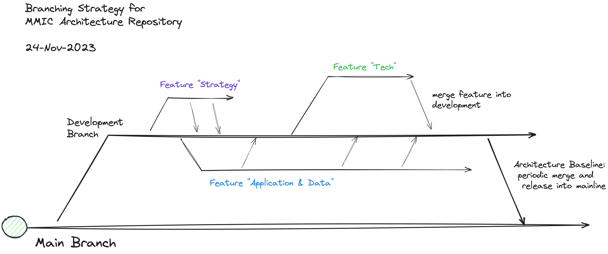

# mmic-architecture-repository-docs

Documentation, instructions, references for the mmic-architecture-repository.

## Overview

## Getting Started

### 0. Prerequisites

You will need:
 - a [github](https://github.com). account
 - access to the [Digital Membership Architecture Repository](https://github.com/mmic-collaboration/mmic-architecture-repository-docs)
 - access to the Digital Membership Monday board for managing Sprints: 
https://team-cpi.monday.com/boards/4183821556/views/114587146

### 1. Setup your local environment
Follow these instructions to set up the MMIC Architecture Collaboration Platform on your local machine: 
[Collaboration Setup](how-to-setup-archi-with-collab-mac.md)

This requires you to [setup authentication](how-to-setup-pat-authentication-for-git.md) to the architecture repository on .

### 2. Choose your workstream

Three workstreams are identified corresponding to the three branches in the repository:

- Strategy & Business Architecture
- Data & Application Architecture
- Technology Architecture

 

### 3. Your first checkout

To checkout the repository for the first time:

 1. Navigate to the [Digital Membership Architecture Repository](https://github.com/mmic-collaboration/mmic-architecture-repository)
 1. Open up archi (with the collaboration plugin already installed)
 1. In the Collaboration Workspace, top right (Menu: Collaboration, Toggle Collaboration Workspace) click the green arrow to open the the 'clone repository' dialog.
 1. If prompted, enter the primary password you assigned in your setup instructions above.
 1. Enter the repository URL: https://github.com/mmic-collaboration/mmic-architecture-repository-docs.git.
 1. enter your git User Name.  The password is your PAT your setup instructions above.
 1. Check the box to store the credentials the password.
 1. hit return to download the repository locally.
 1. double click the repository name, top right to open the model

### 4. Commit and push Changes back to the repository

To checkout the repository for the first time:

 1. Make your change in the repository
 1. Right-click the repository, choose collaboration, publish changes
 1. Enter a meaningful commit message, prefixed with your story number from Monday. Thenhit return.
 1. You should now see your commit in the [https://github.com/mmic-collaboration/mmic-architecture-repository](repository).
 
The final step is to create a pull request so your change can be reviewed by the branch owner before its added to the core architecture branch.

### 5. Create a pull request to merge your changes back to the core architecture branch

 1. From the [Digital Membership Architecture Repository](https://github.com/mmic-collaboration/mmic-architecture-repository), make sure you are in the feature branch where you have just made the change
 1. "Compare and Pull Request"
 1. Check you are pulling into dvelopment from your feature branch
 1. Add a title and optionally a description, if your change is complex
 1. hit "Create Pull Request"

## Where to get More Information

 - [Digital Membership Architecture Repository](https://github.com/mmic-collaboration/mmic-architecture-repository-docs)
 - TOGAF Method
 - Archi
 - [MMIC Digital Membership Sharepoint](https://cpiit.sharepoint.com/sites/MMICDigitalMembership-External/Shared%20Documents)

