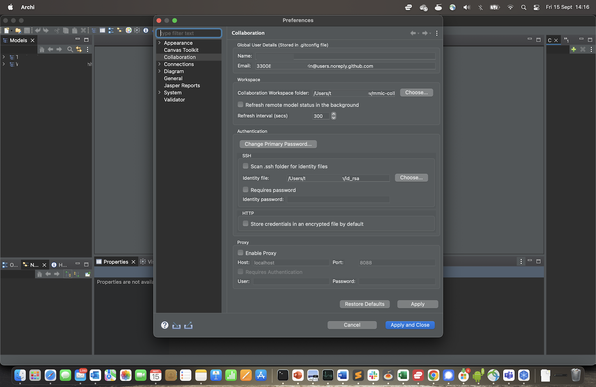
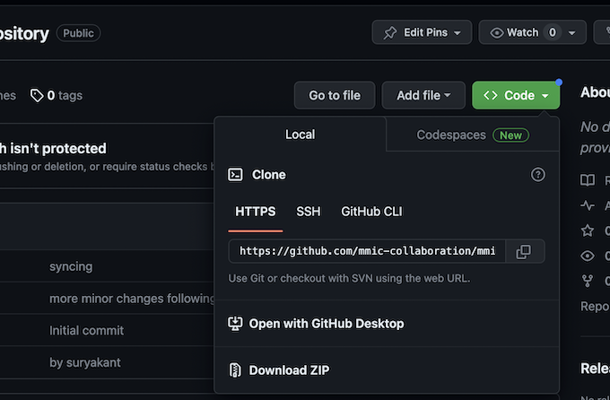
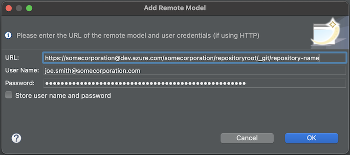
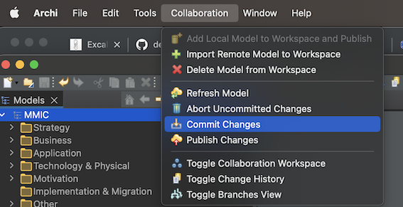

# HOW-TO: Setup Archi with the Collaboration Plugin on a Mac
 

 
This guide shows you how to setup Archi with the Collab plug-in and work from git to manage the configuration of rich coherent Archimate models across open teams.

This how-to is dependent on:

 - [How to setup PAT Authentication for Git](how-to-setup-pat-authentication-for-git.md)

This pattern has been tested on:

 - MacOS 12

## Prerequisites

  1. Archi installed: https://www.archimatetool.com/download/

  1. Installed the Archi collaboration Plugin: https://www.archimatetool.com/plugins/#coArchi

  1. A [GitHub](https://github.com) account and access to the  repository as a contributor (i.e. able to check-in).  See [How to setup an archi repository on GitHub](how-to-setup-an-archi-repository-in-git.mdrepository).

  1. You have set up your Personal Access Token for authentication.  This is the easiest way to authenticate since [GitHub removed user/password authentication](https://github.blog/changelog/2021-08-12-git-password-authentication-is-shutting-down/) in 2021. ([how to setup PAT](how-to-setup-pat-authentication-on-git.md)).

  1. (Optional) SSH public/private key authentication setup, if you prefer over PAT ([how-to](how-to-ssh-config-mac.md)).

## How to...
    
  1. **Configure Archi for Collaboration:**
      1. Open Archi, navigate to Archi menu -> preferences. 
      
      1. Click "Change Primary Password" to setup a password for encryption.  This is not a login password.  Its just used to make keys.
      1. Set your 'Workspace Collaboration Folder' where Archi will store cloned repositories.  Something like */Users/MyUser/MyGitRepositories/Archi*.  If it doesn't exist, Archi will use a defaul location.
      1. Add your Name and Email, which will appear in your commit messages.  If the repository is public, or you don't want to share your email address, you can [set up an anonymous mail alias in Git](https://docs.github.com/en/account-and-profile/setting-up-and-managing-your-personal-account-on-github/managing-email-preferences/setting-your-commit-email-address) and use that instead, e.g. 12345678+joesmith@users.noreply.github.com.
      1. (Optionally) add your ssh key location as per the [ssh how-to](how-to-setup-ssh-authentication-on-git.md).  The default is */Users/MyUser/.ssh/id_rsa*.

  1. **Clone the model from the remote repository to your local machine**
      1. navigate to the repository homepage in github: 
      
      1. Click the Code button, select the HTTPS tab, and copy the url. (If using ssh, select the SSH tab).
      1. Back in Archi, toggle collaboration workspace -> a panel appears on the right
      1. Click green cross to add the repository -> the clone repo' dialog appears 
      
      1. If using PAT, paste the HTTPS repo URL, enter your git username, and your PAT token as the password.  If you wish to save the credentials for the next opeation, check the box.  The repo should appear in the Collab panel on the right. (If using ssh, just paste in the SSH URL - no need for anything else.)
      1. Double-click on the repository in the collaboration panel on the right -> The model should appear in the 'Models' explorer on the left. 

  1. **Make some change and publish:**
      1. Make a change, e.g. open a view and add an archimate note object. Save.
      1. (Optional) if you don't yet wish to push the change to the server, commit the file locally: right click on the repository name, Select "Collaboration", Select "Commit Changes".  Add a *meaningful* (e.g. "added note to diagram xyz"), and click ok -> if the check-in is successful, you will receive no message. 
           
      1. Push the changes to the server: right click on the repository name, Select "Collaboration", Select "Publish Changes".  If you havent' already checked in, add a *meaningful* (e.g. "added note to diagram xyz"), and click ok.  
      1. If you haven't cached your username and password during the checkout, you will need to enter your name and PAT password agail.
      1. Finally, check the remote repository has captured your changes.  You should see your commit message from above in the change history on the repository 

## References and Further Information
  - https://www.archimatetool.com/download/
  - https://www.archimatetool.com/plugins/#coArchi
  - https://github.com/archimatetool/archi-modelrepository-plugin/wiki
  - https://help.github.com/en/github/authenticating-to-github/working-with-ssh-key-passphrases
  - https://rogerdudler.github.io/git-guide/

## Code
 - HTTPS: https://github.com/mmic-collaboration/mmic-architecture-repository.git
 - SSH: git@github.com:mmic-collaboration/mmic-architecture-repository.git
