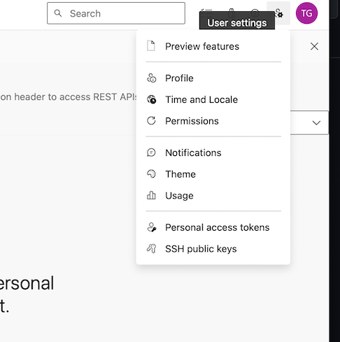
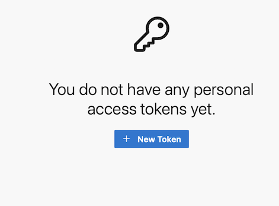
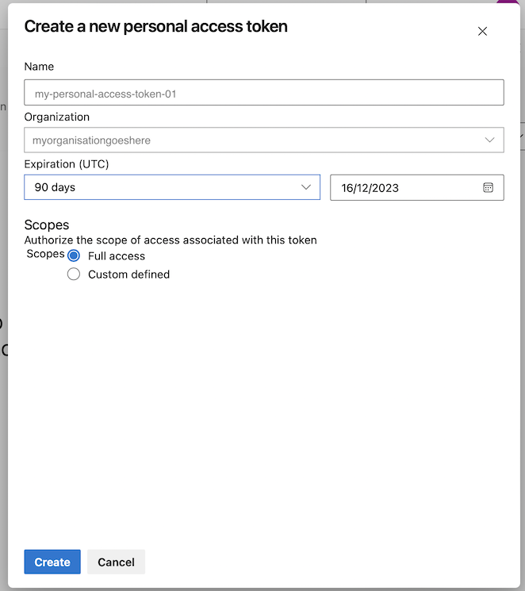

# HOW-TO setup Personal Access Token authentication for GIT

This simple pattern will let you authenticate in git using a Personal Access Token (or PAT) which you generate in GitHub.
 
This pattern has been tested on:

 - Mac 12
 - Windows

## Prerequisites
 
 - A [GitHub](https://github.com) or [Azure DevOps](https://dev.azure.com/) account.
 - A Git client, e.g. [Git Desktop](https://desktop.github.com), or a built-in client like the [archi collab plugin](how-to-setup-archi-with-collab-mac.md).

## How-to

  1. Login to git and navigate to your profile page. 
  

  1. Select "Create new PAT".  if you have no tokens setup, you will see this: 
  

  1. Create your new Personal Access Token: 
  
      1. Define a *name*, something that indicates the scope of access.
      1. Define the scope, e.g. "rights relating to repository management".
      1. Click save.  This will generate your Personal Access Token.
      1. **VERY IMPORTANT** Copy the token, paste it in your favorite text editor and SAVE IT!  If you lose it you will not be able to use it and you will need to make a new one.

Thats it!  you can now test your access token with a variety of git clients with your git username and your new PAT as your password, for example in the  - [Archi Collab How-to](how-to-setup-archi-with-collab-mac.md).

## References and resources

 - git-account : timothygalvin
 - pat-user-settings-png : 
 - create-new-pat-png :
 - no-pat-png :
 - pat-git-png : 

## Related Patterns

 - [How to setup Archi with the Collab plug-in](how-to-setup-archi-with-collab-mac.md)
 - [How to setup SSH authentication for Git](how-to-setup-ssh-authentication-for-git.md)

## References and Further Information
  - https://docs.github.com/en/authentication/keeping-your-account-and-data-secure/managing-your-personal-access-tokens
  - https://learn.microsoft.com/en-us/azure/devops/organizations/accounts/use-personal-access-tokens-to-authenticate?view=azure-devops&tabs=Windows
  - https://www.archimatetool.com/download/
  - https://www.archimatetool.com/plugins/#coArchi

